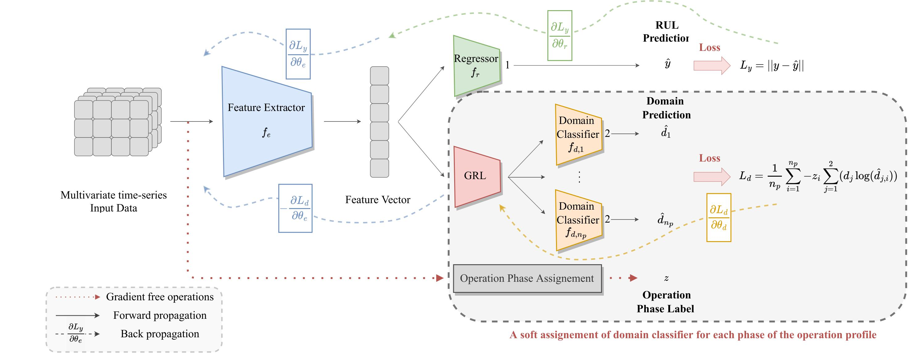

# Domain Adaptation via Alignment of Operation Profile for RUL Prediction

This repository contains the official PyTorch implementation of the paper: **"Domain adaptation via alignment of operation profile for remaining useful lifetime prediction"**.

[](https://opensource.org/licenses/MIT)
[](https://www.python.org/downloads/)
[](https://pytorch.org/)

---

## Overview

This method introduces a Domain Adversarial Neural Network (DANN) enhanced with an Operation Condition (OC) Classifier. By aligning the operation profiles (e.g., ascending, steady, descending phases of flight) between different flight conditions (short, medium, and long flights), the model learns robust, domain-invariant features for Remaining Useful Lifetime (RUL) prediction.

<p align="center">
  
</p>
<p align="center">
  <em>Figure 1: Overview of the proposed OCS-DANN framework.</em>
</p>

### Key Contributions
- **OCS-DANN (hard)**: Uses hard pseudo-labels to align specific flight phases.
- **MOCS-DANN (Soft)**: Uses probability weights for soft alignment of operation profiles.
- **Improved Robustness:**: Significant RMSE reduction compared to standard DANN and MK-MMD on the N-CMAPSS dataset.

---

## Quick Start

### Prerequisites
```bash
Python 3.9
PyTorch 1.10+
CUDA >= 11.3
```

### Installation

1. **Clone the repository**

2. **Create virtual environment**
```bash
conda env create -f environment.yml
conda activate rul-da
```

### Dataset Setup

1. **Download Data:** Get the N-CMAPSS dataset from [NASA Prognostics Data Repository](https://www.nasa.gov/content/prognostics-center-of-excellence-data-set-repository)
    * Dataset: Turbofan Engine Degradation Simulation-2
    * Download Link: [Direct Zip Download](https://phm-datasets.s3.amazonaws.com/NASA/17.+Turbofan+Engine+Degradation+Simulation+Data+Set+2.zip)
    * Citation: M. Chao, C.Kulkarni, K. Goebel and O. Fink (2021). “Aircraft Engine Run-to-Failure Dataset under real flight conditions”, NASA Prognostics Data Repository, NASA Ames Research Center, Moffett Field, CA
    * Google drive link: https://drive.google.com/file/d/1bReVGe3svZBcmJxf1AQBRHsHYfWqWIDg/view?usp=drive_link
2. **Organize:** Place `.h5` files in the `data/` directory:

3. **Preprocess the data:** Run the downsampling script to generate domain-specific CSVs (Short, Medium, Long) at 0.1 Hz.
```bash
python source/downsampling.py
```
This will create files like `df_short_downsampled_advanced_3.csv` in the `data/` folder.

---

## Training Models

### Directory Structure
```
rul-domain-adaptation/
├── data/                          # Dataset files
├── figures/                       # Paper figures and assets
├── TrainedModels/                 # Saved models and results
│   ├── Baseline/
│   ├── OCS-DANN/
│   └── ...
└── source
    ├── model.py                       # Model architectures
    ├── dataloader.py                  # SequenceDataset and DataLoaders
    ├── utils.py                       # Loss functions (RMSE, NASA) & Helper functions
    ├── train_baseline.py              # Lower Bound (Source Only)
    ├── train_DANN.py                  # Standard DANN 
    ├── train_DANN-OCS.py              # OCS-DANN (soft) 
    └── train_DANN-OCS_hard.py         # OCS-DANN (hard) 

```

### Running Experiments

You can configure hyperparameters (Source/Target domains, Learning Rate, Epochs) at the top of every training script.

#### 1. Lower Bound (No Adaptation)
Training only on source data without adaptation

```bash
python source/train_baseline.py
```

#### 2. DANN (Domain Adversarial)

Standard domain adaptation without operation profile alignment.

```bash
python source/train_DANN.py
```

#### 3. OCS-DANN (Hard)

The variant using hard pseudo-labels for operation conditions.

```bash
python source/train_DANN-OCS_hard.py
```

#### 4. OCS-DANN (Soft)

The variant using soft probability weighting.

```bash
python source/train_DANN-OCS.py
```
---

## Model Architectures

The backbone feature extractor is a 1D-CNN designed for time-series sensor data:

```
Input (50 × 18) 
  → Conv1D(10 channels, kernel=10) → ReLU
  → Conv1D(10 channels, kernel=10) → ReLU  
  → Conv1D(1 channel, kernel=10) → ReLU
  → Flatten → FC(50) → ReLU → FC(1) → Sigmoid
```

### OCS-DANN Architecture
- **RUL Regressor**: Predicts remaining useful life
- **OC Classifier**: Identifies operating conditions (Ascending/Steady/Descending)
- **Domain Discriminator(s)**: FC layers distinguishing Source vs Target

---

## Evaluation & Visualization

Evaluation is performed automatically during training. To evaluate a pre-trained model manually:

### Evaluate Trained Models
```python
from utils import test, test_RUL_cycles
from model import CNN_DANN_OCS_hard

# Load model
model = CNN_DANN_OCS_hard(num_features=18, length=50)
model.load_state_dict(torch.load('path/to/model.pt'))

# Test on target domain
test_losses, preds, targets = test(target_loader, model, [RMSE_loss], ['RMSE'])

# Convert to cycle-based RMSE
test_losses_RUL, preds_cycle, targets_cycle = test_RUL_cycles(
    preds, targets, [RMSE_loss], ['RMSE'], 
    target_domain['unit'], dict_target
)
```

---

## Citation

If you use this code  please cite:

```bibtex
@article{nejjar2024domain,
  title={Domain adaptation via alignment of operation profile for remaining useful lifetime prediction},
  author={Nejjar, Ismail and Geissmann, Fabian and Zhao, Mengjie and Taal, Cees and Fink, Olga},
  journal={Reliability Engineering \& System Safety},
  volume={242},
  pages={109718},
  year={2024},
  publisher={Elsevier}
}
```

---

## License

This project is licensed under the MIT License - see the [LICENSE](LICENSE) file for details.

---
